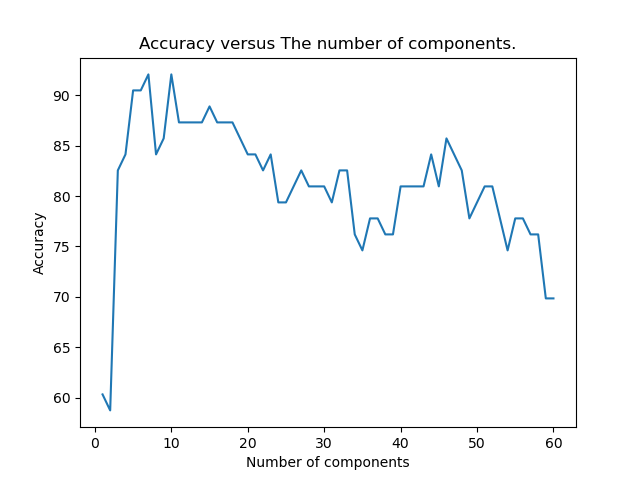

## :notebook: Homework for EEE-591

1. [Homework 1](./hw1/)
    - [Questions](./hw1/hw1_root.pdf)

2. [Homework 2](./hw2/)
    - [Questions](./hw2/hw2_pi.pdf)
    - 
    - 

3. [Homework 3](./hw3/)
    - 

4. [Homework 4](./hw4/)
    - 
    - 

## :blue_book: Projects for EEE-591

2. [Project 2](./proj2/)
    - [Question](./proj2/Project_minevsrock.pdf)
    - [Report](./proj2/proj2.pdf)
    - [Final Code](./proj2/proj2.py)
    - Notebooks
      - [Grid-Search](./proj2/Grid_Search.ipynb)
      - [Project piece](./proj2/Project-2.ipynb)
    
    - 
### :snake: Requirements

- [requirements.txt](./requirements.txt)
