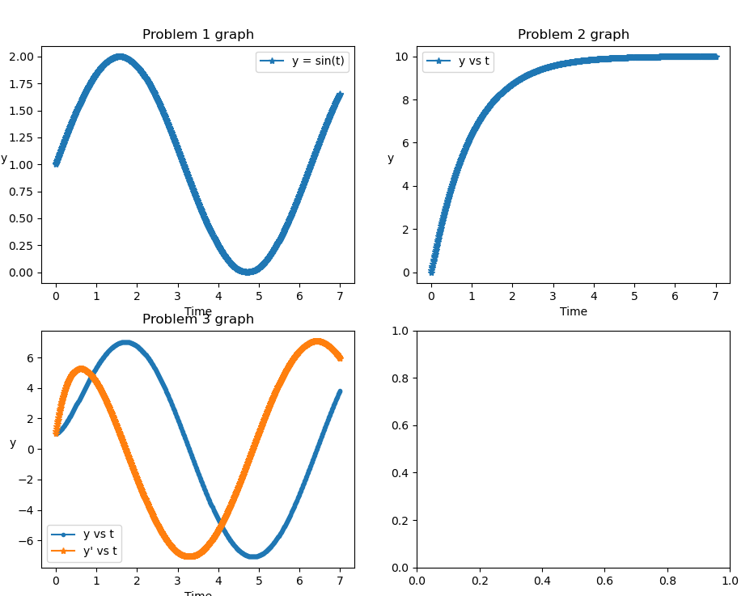
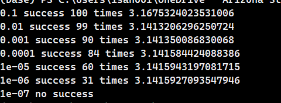
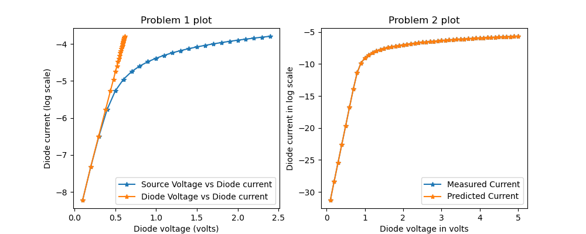

## :notebook: Homework for EEE-591

1. [Homework 1](./hw1/)
    - [Questions](./hw1/hw1_root.pdf)

2. [Homework 2](./hw2/)
    - [Questions](./hw2/hw2_pi.pdf)
    - 
    - 

3. [Homework 3](./hw3/)
    - 

4. [Homework 4](./hw4/)
    - 
    - 

5. [Homework 5](./hw5/)
    - 
6. [Homework 6](./hw6/)
    - 
## :blue_book: Projects for EEE-591

2. [Project 2](./proj2/)
    - [Question](./proj2/Project_minevsrock.pdf)
    - [Report](./proj2/proj2.pdf)
    - [Final Code](./proj2/proj2.py)
    - Notebooks
      - [Grid-Search](./proj2/Grid_Search.ipynb)
      - [Project piece](./proj2/Project-2.ipynb)
    
    - 

3. [Project 3](./proj3/)
    - [Description](./proj3/DiodeNonlinear_v5c.pdf)
    - [Code](./proj3/proj3.py)
    - 

4. [Project 4](./proj4/)
    - [Description](./proj4/Project%204.pdf)
    - [Code](./proj4/project4.py)
    - 


    Steps for the setting up project 4 via scp

    - Create a folder named **Proj 4** in the machine in which you have logged in
    - In the **Proj 4** folder scp the following files 'cmoslibrary.lib', 'project4.py', 'utils.py', 'InvChainTemplate.sp'. All the files should be in the same Proj 4 folder and in the same subtree.
      - scp project4.py utils.py cmoslibrary.lib InvChainTemplate.sp <target_remote_path>/Proj_4
      - 
    - Run project4.py as follows
        
        ```python3 project4.py```
    - After execution is complete, you can delete the Proj_4 folder using 
        ```rm -r Proj_4/```

### :snake: Requirements

- [requirements.txt](./requirements.txt)
