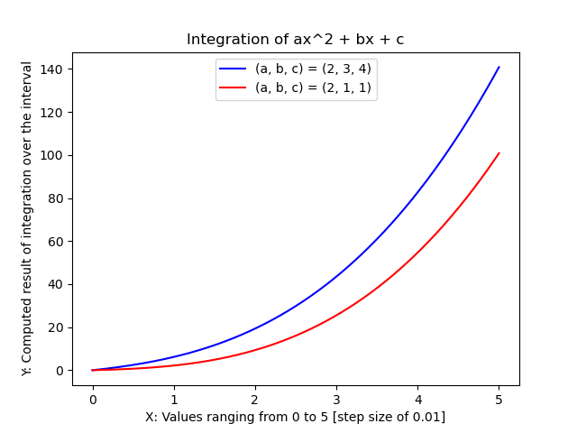
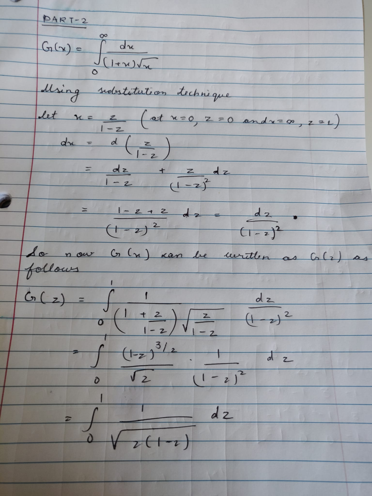
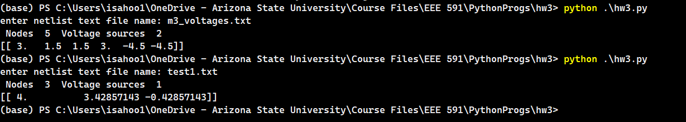
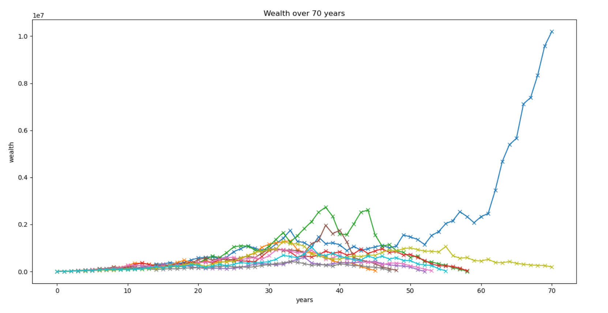

## :notebook: Homework for EEE-591

1. [Homework 1](./hw1/)
    - [Questions](./hw1/hw1_root.pdf)

2. [Homework 2](./hw2/)
    - [Questions](./hw2/hw2_pi.pdf)
    - 
    - 

3. [Homework 3](./hw3/)
    - 

4. [Homework 4](./hw4/)
    - 
    - 

### :snake: Requirements

- [requirements.txt](./requirements.txt)
